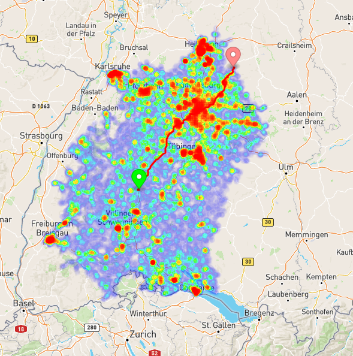
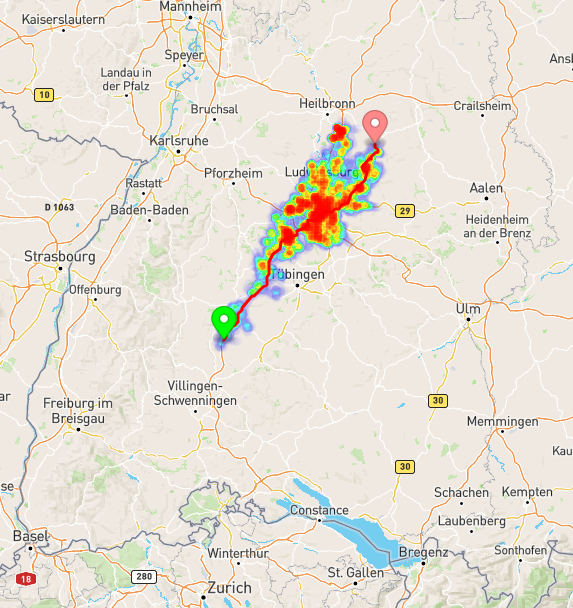
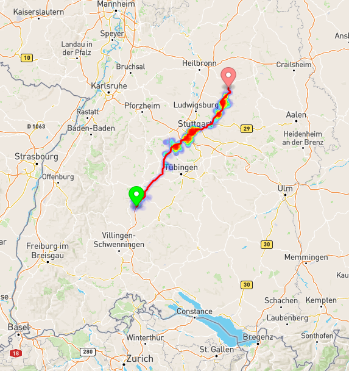

Coyote is a dead simple, easy-to-understand routing engine. 
It parses [Open Street Map](https://www.openstreetmap.org)'s data, and creates a graph structure. 
After that, It's all left to graph algorithms to compute the shortest path. 
Currently, Coyote implements Dijkstra, A*, and ATL (A* with triangle inequality).

### How to Run  
You can use Maven to install all the dependencies outlined in `pom.xml` and 
build the project. After that, run `MapServer.java` in the `web` package. 
You must provide the program with two arguments, a port number, and  
the location of OSM file. 
```
java com.coyote.web.server.MapServer -f /home/mehrdad/saarland.osm -p 8080
```
After starting the server, open `map.html` in the `web` package in `chrome` browser, 
and start running queries. You can run the server using different algorithms. 
Additionally, there is a debug button, that visualizes the visited nodes when the 
query was run. It's fun visualizing different algorithms, and getting an idea 
of their effectiveness in searching the graph. 


Dijkstra            |         AStar         | ATL
:-------------------------:|:---------------------:|:-------------------------:
   |  | 

### Benchmarks
Coyote parses OSM's data and builds the underlying graph structure. 
For simplicity, It assumes that all roads are bidirectional. 
Below are benchmarking results for this operation for two states in Germany. 

```
Benchmark                 (city)  Mode  Cnt  Score   Error  Units
BenchLLC.LLC  baden-wuerttemberg  avgt   10  4.191 ± 3.881   s/op
BenchLLC.LLC            saarland  avgt   10  0.187 ± 0.033   s/op
```

After the graph is built, Coyote reduces it to the largest connect 
component. Here are the results for this operation.  
```
Benchmark                             Mode  Cnt   Score     Error  Units
BenchGraphBuilder.buildBadenWuGraph   avgt    3  58.999 ± 162.193   s/op
BenchGraphBuilder.buildSaarlandGraph  avgt    3   4.169 ±   3.548   s/op
```
The simplest algorithm to run after the graph is built and reduced to largest  component is Dijkstra. 
Here are the results for uniformly distributed queries on the two road networks mentioned above 
```
Benchmark                           (city)  Mode  Cnt     Score     Error  Units
BenchDijkstra.Dijkstra  baden-wuerttemberg  avgt   20  1377.220 ± 249.408  ms/op
BenchDijkstra.Dijkstra            saarland  avgt   20    50.391 ±   3.412  ms/op
```
### Contribution 
If you felt like this project was fun and wanted to contribute, 
here are some of the things you can do: 
- implement contraction hierarchies 
- persist graphs to disk 
- rewrite the web server altogether :)
- add support for GTFS data
- implement a Quad Tree for efficient point location queries
- write more tests 
- dockerize the project

There are lots of other minor optimizations that you can do to improve the code. 
But most of them come, at the expense of losing simplicity, and that was 
the main reason behind this project.S
### Acknowledgement
I strictly followed Prof. Hannah Bast's "Efficient Route Planning" 
lectures when implementing Coyote. If you want to write your own 
routing engine, you can watch the course 
[here](https://ad-wiki.informatik.uni-freiburg.de/teaching/EfficientRoutePlanningSS2012) !