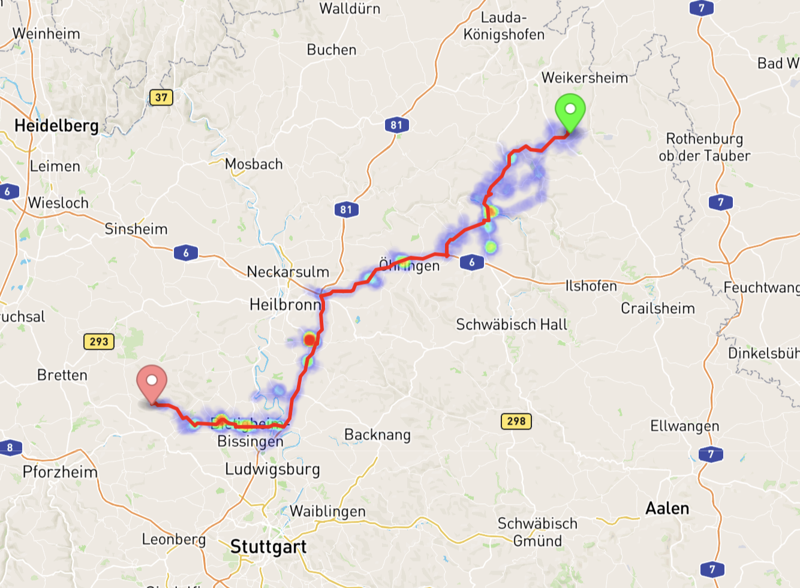

This is still a work in progress. I'm working on Contraction Heirarchies and GTFS. The following picture shows how the final result looks like. It's an interactive map where you can select start and end points. Additionally visited nodes are shown using a heatmap to differentiate routing algorithms between one another. The server code is nothing close to good, and I'm only experimenting. I might rewrite everything in Go :))

